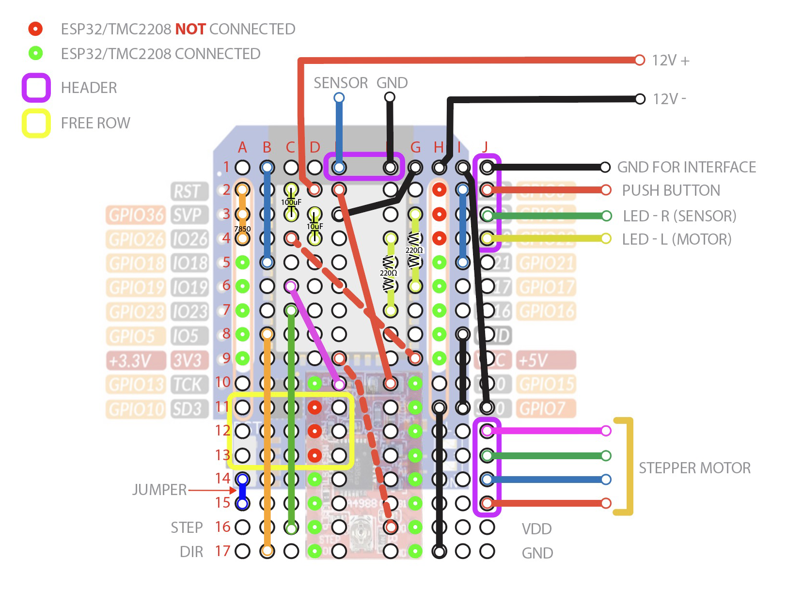

# LTS Respooler – ESP32 NodeMCU (WEMOS D1 Mini) Edition

This project is a **stripped-down version** of the [LTS Respooler](https://github.com/LukasT03/LTS-Respooler), adapted to run on the **WEMOS D1 Mini ESP32 (ESP-WROOM-32)**.  

The LTS Respooler is a motorized tool for **respolling 3D printer filament**. It connects via **Bluetooth** to the official **LTS iOS app** or the [LTS Design Web App](https://lts-design.com/pages/software), allowing you to start/stop spooling, change direction, and monitor progress.

This version keeps the **core functionality** but removes some of the advanced features so it will fit and run reliably on a smaller ESP32 NodeMCU board.

---

## ✂️ Changes from the Original Project

The original firmware includes OTA updates, WiFi scanning, fan control, LED effects, torque monitoring, and adjustable motor strength.  

In order to fit the sketch on the WEMOS D1 Mini ESP32, this fork **does not implement**:
- OTA updates  
- WiFi scanning and connection  
- Fan control  
- LED status patterns (basic LED feedback only)  
- Torque monitoring  
- Motor strength adjustments  

Everything else, including **Bluetooth connectivity to the LTS apps**, remains supported.

---

## 🔧 Hardware Setup

- **Board:** WEMOS D1 Mini ESP32 (ESP-WROOM-32 module)  
- **Motor driver:** TMC2209 (via UART)  
- **Filament sensor** (optional, for detecting filament presence)  
- **Mini PCB breadboard** for soldering headers and connections  

